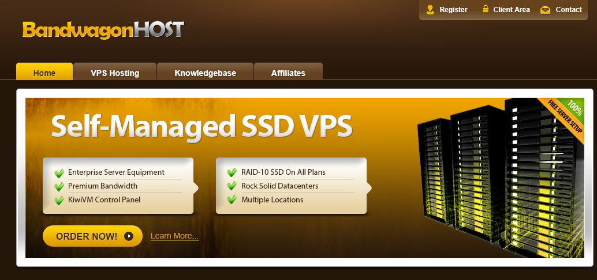
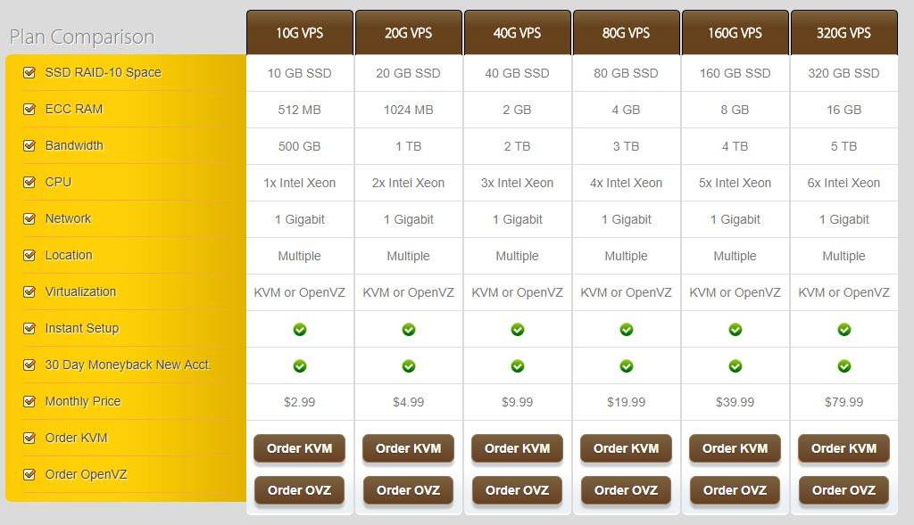
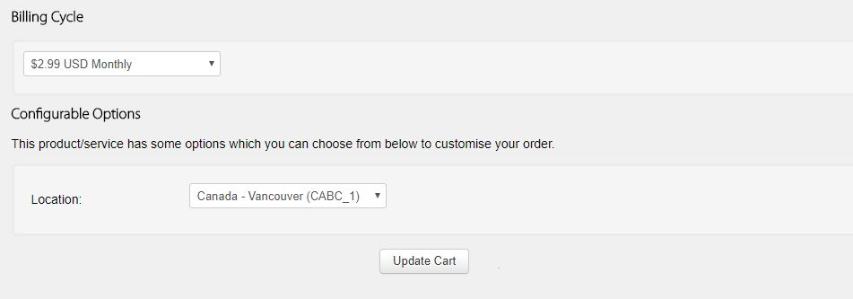
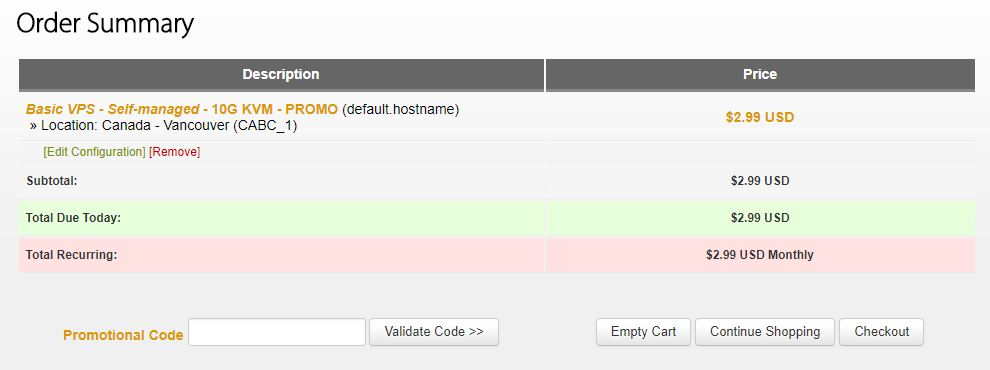
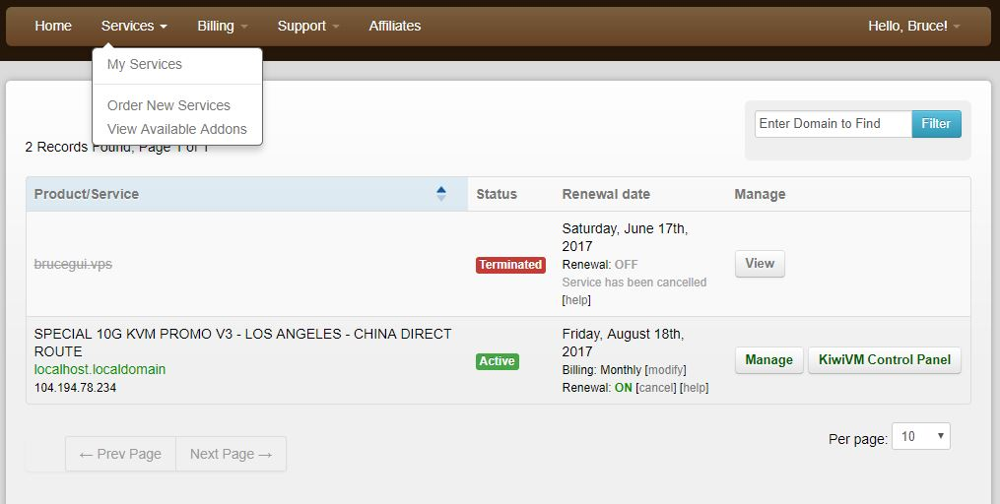
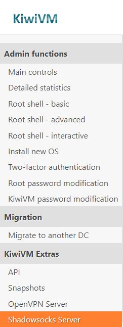
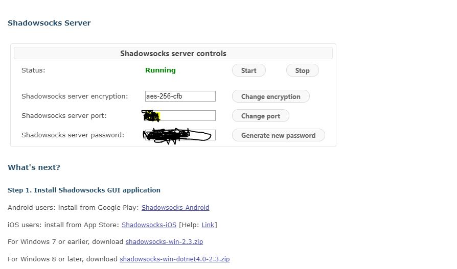
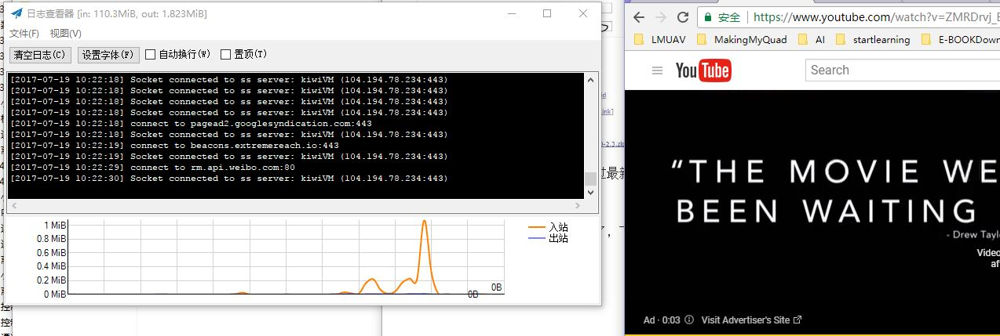

## 前言

关于为什么要自己搭建SS服务器，我也是迫不得已才这么做的，谁叫中国政府把国内VPN都封了。为了时不时用一用Google,上Youtube看一看视频什么的，这才决定自己动手丰衣足食。

## 内容

这篇README仅仅是记录自己搭建SS服务器的过程，没有什么理论只是，就是按部就班的敲敲键盘，动动鼠标啊，就好比是傻瓜式的吧。

## 要求

虽然是傻瓜式的，但如果对一些概念有所了解，也不至于全程都处于懵逼状态，至少知道自己在干什么：

- 知道SS是什么，VPS是什么
- 有探索精神，不怕吃苦，不怕失败
- 有钱，有支付宝更好啊

## 开始

### 购买VPS Hosting

为了让自己的SS服务器有一定的实用性，需要购买一个可以到处都能访问到的主机，这里就是VPS了，而且要买国外的。这里我选择[这个VPS](https://bwh1.net/index.php),原因如下1)便宜而且够用，每个月的流量也很多，2)可以用支付宝支付，方便快捷啊，3)支持一键安装SS服务器，而且启用、停止方便。不过这个也是有一定缺点的，总感觉这个控制台不是很稳定，所以操作要小心啊。

首先进入VPS官网，界面如下：

然后，当然是注册了。等注册成功点击 VPS Hosting 菜单，就出来一些可选择的VPS 配置：

 

这里我选择了最低配置，毕竟只是用一个SS服务，要不了多少资源，看下带宽，一个人够用了，点击 Order KVM。然后就开始选择购买时长、付款方式了。

 

时间随自己选，地点也随便，然后点击 Update Cart。

 

直接点击 Checkout 就开始支付了，支付成功就可以使用了。

 

注意付款方式选择Alipay比较方便，当然随便你了。付款成功后点击Services菜单下的My Services就可以看到你购买的服务器列表了：

 

接着，就进入KiwiVM 控制台，可以对自己的VPS进行一些操作，这个VM默认安装的是Centos 操作系统，你也可以自己换成其它的操作系统，不说了，接下来就一键安装SS服务器吧。

 

点击左边栏最下面的Shadowsocks Server，安装提示安装SS服务器。安装完成后会出现 如下所示的信息和帮助：

 

你也可以安装它给的教程连接，不过最新版的SS客户端请到这里下载：

[Windows 版](https://github.com/shadowsocks/shadowsocks-windows/releases)  [Mac 版](https://github.com/shadowsocks/ShadowsocksX-NG/releases) [Android 版](https://github.com/shadowsocks/shadowsocks-android/releases) 

如果没什么意外，就可以直接连同了，下面是我的连接效果，速度感觉比VPN快。

 

## 参考连接

[VPS 选择](http://www.laozuo.org/myvps)

[SS 官网](https://shadowsocks.org/en/index.html) 